# 🐧 Antarcticom

> Next-generation communication platform. Native-first, self-hostable, privacy-respecting.

[]()
[]()
[]()

## What is Antarcticom?

Antarcticom is a **Discord / TeamSpeak alternative** built from the ground up with native performance and self-hosting in mind. The client is a cross-platform Flutter app (no Electron). The server is a Rust binary with RS256 federated authentication — community servers can be hosted anywhere and authenticate against a shared Auth Hub without sharing any secrets.

## Features

| Feature | Status |
|---------|--------|
| Real-time messaging (WebSocket) | ✅ |
| Voice chat (Opus / QUIC) | ✅ |
| Role-based permissions | ✅ |
| User avatars | ✅ |
| Themed UI (Stars, Sun, Moon, Field) | ✅ |
| RS256 federated authentication | ✅ |
| Self-hosted community servers | ✅ |
| End-to-end encryption | 🚧 |
| Mobile apps (Android / iOS) | 🚧 |
| File sharing | 📋 |
| Video calls | 📋 |

✅ Done · 🚧 In progress · 📋 Planned

## Architecture

```mermaid
graph LR
    Client["🖥️ Flutter Client"]
    Standalone["🏠 Standalone Server"]
    AuthHub["🔐 Auth Hub"]
    Community["🌐 Community Server"]

    Client -- "HTTPS + WS" --> Standalone
    Client -- "HTTPS + WS" --> Community
    Client -- "Login / Register" --> AuthHub
    Community -- "GET /api/auth/public-key" --> AuthHub
    AuthHub -- "Signs RS256 JWTs" --> AuthHub
    Community -- "Verifies tokens locally" --> Community
```



**Standalone** mode combines Auth Hub + Community into a single process (great for dev and small deploys). For federation, split into separate Auth Hub and Community instances.

## Quick Start

### 🖥 Download the Client

Pre-built binaries on the [Releases](https://github.com/ItsKorayYT/antarcticom/releases) page, or build from source:

```bash
cd client && flutter pub get && flutter run -d windows
```

### 🏠 Host a Community Server

Point `AUTH_HUB_URL` to any Auth Hub (the official one or your own):

```bash
AUTH_HUB_URL=https://your-auth-hub.com \
  docker compose -f docker/docker-compose.community.yml up -d
```

### 🔐 Run a Standalone Server (Auth + Community)

```bash
docker compose -f docker/docker-compose.yml up -d
```

RSA keys for JWT signing are auto-generated on first startup.

> [!WARNING]
> Running your own Auth Hub creates a **separate user pool**. Users registered on one Auth Hub cannot authenticate with community servers linked to a different Auth Hub. This is by design (similar to Matrix homeservers) and is the expected choice for private or corporate deployments.

### 🛠 Development

**Prerequisites:** Flutter SDK, Rust toolchain, PostgreSQL, Redis, `protoc`

```bash
# Clone
git clone https://github.com/ItsKorayYT/antarcticom.git
cd antarcticom

# Server
cd server && cargo run

# Client (in another terminal)
cd client && flutter pub get && flutter run -d windows
```

## Tech Stack

| Layer | Technology |
|-------|-----------|
| Client | Flutter (Skia / Impeller) |
| Server | Rust (Tokio + Axum) |
| Database | PostgreSQL + Redis |
| Voice transport | QUIC / UDP (Opus) |
| Serialization | Protocol Buffers |
| Auth | RS256 JWT (public-key) |

## Project Structure

```
antarcticom/
├── client/      Flutter client app (Windows, Android, Web)
├── server/      Rust server (Tokio + Axum)
├── proto/       Protobuf definitions
├── docker/      Docker Compose files & Dockerfile
└── docs/        Self-hosting, deployment, and architecture guides
```

## Documentation

- [Self-Hosting Guide](docs/self-hosting.md)
- [Deployment Guide](docs/deployment.md)
- [Architecture Overview](docs/architecture.md)
- [Client README](client/README.md)
- [Server README](server/README.md)

## License

TBD
