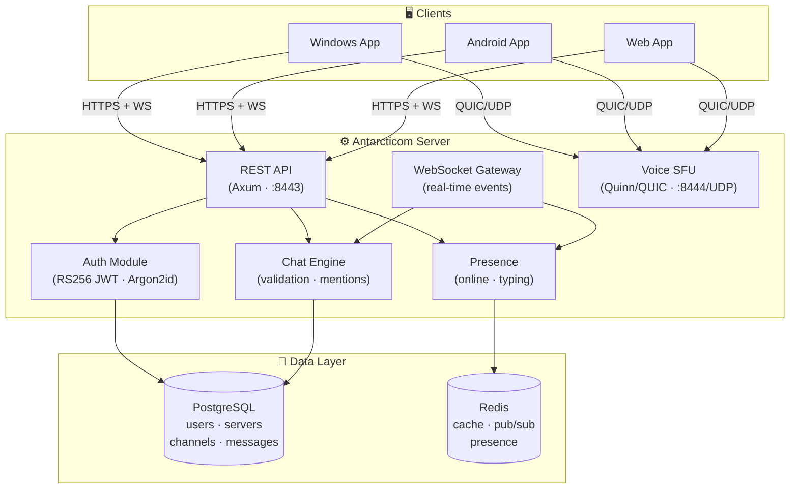
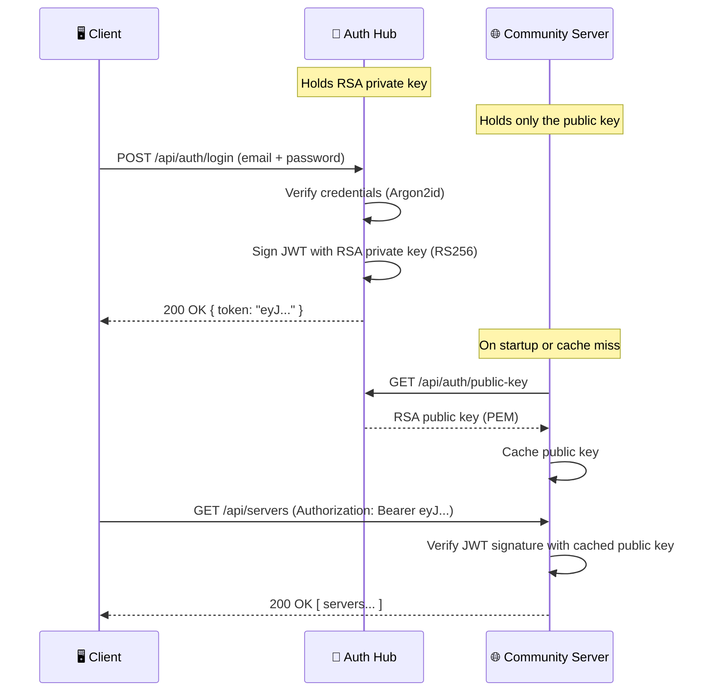
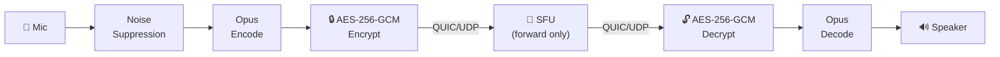

# Antarcticom Architecture

Overview of the Antarcticom server internals, module structure, and federated authentication model.

## Quick Reference

### System Components

| Component | Technology | Port |
|-----------|-----------|------|
| API + WebSocket | Rust (Axum) | 8443 |
| Voice SFU | Rust (Quinn/QUIC) | 8444/UDP |
| Database | PostgreSQL | 5432 |
| Cache/Pub-Sub | Redis | 6379 |

### Module Map

```
server/src/
├── main.rs       → Entry point, server boot, mode selection
├── config.rs     → Configuration (antarcticom.toml + env)
├── error.rs      → Error types & HTTP responses
├── models.rs     → All data models + Snowflake IDs
├── db.rs         → Database queries (users, servers, channels, messages)
├── auth.rs       → Argon2 password hashing + RS256 JWT signing (public-key authentication)
├── api.rs        → REST endpoints + WebSocket gateway + public-key endpoint
├── chat.rs       → Message validation, mentions, sanitization
├── presence.rs   → Online status + typing indicators
├── voice.rs      → QUIC SFU voice server
└── crypto.rs     → AES-256-GCM, Ed25519, X25519, HKDF
```

### System Architecture



### Server Modes & Federated Authentication

Antarcticom supports three operating modes to enable federation:



**Standalone** mode combines both Auth Hub and Community into a single process.

**Key security property:** Community servers never see the private key. Authentication is verified purely via RS256 public-key cryptography — **no shared secrets** between the Auth Hub and Community servers.

### Voice Pipeline



### Encryption Model

- **DMs**: Signal Double Ratchet (X3DH + AES-256-GCM)
- **Voice**: Per-frame AES-256-GCM with counter nonces
- **Transport**: TLS 1.3 (API) + QUIC (voice)
- **Passwords**: Argon2id
- **JWT Signing**: RS256 (RSA-2048 + SHA-256)
