# Antarcticom Architecture

Overview of the Antarcticom server internals, module structure, and federated authentication model.

## Quick Reference

### System Components

| Component | Technology | Port |
|-----------|-----------|------|
| API + WebSocket | Rust (Axum) | 8443 |
| Voice SFU | Rust (Quinn/QUIC) | 8444/UDP |
| Database | PostgreSQL | 5432 |
| Cache/Pub-Sub | Redis | 6379 |

### Module Map

```
server/src/
├── main.rs       → Entry point, server boot, mode selection
├── config.rs     → Configuration (antarcticom.toml + env)
├── error.rs      → Error types & HTTP responses
├── models.rs     → All data models + Snowflake IDs
├── db.rs         → Database queries (users, servers, channels, messages)
├── auth.rs       → Argon2 password hashing + RS256 JWT signing (public-key authentication)
├── api.rs        → REST endpoints + WebSocket gateway + public-key endpoint
├── chat.rs       → Message validation, mentions, sanitization
├── presence.rs   → Online status + typing indicators
├── voice.rs      → QUIC SFU voice server
└── crypto.rs     → AES-256-GCM, Ed25519, X25519, HKDF
```

### System Architecture

```mermaid
graph TB
    subgraph Clients["🖥️ Clients"]
        Win["Windows App"]
        And["Android App"]
        Web["Web App"]
    end

    subgraph Server["⚙️ Antarcticom Server"]
        API["REST API\n(Axum · :8443)"]
        WS["WebSocket Gateway\n(real-time events)"]
        Voice["Voice SFU\n(Quinn/QUIC · :8444/UDP)"]
        Auth["Auth Module\n(RS256 JWT · Argon2id)"]
        Chat["Chat Engine\n(validation · mentions)"]
        Presence["Presence\n(online · typing)"]
    end

    subgraph Data["💾 Data Layer"]
        PG[("PostgreSQL\nusers · servers\nchannels · messages")]
        RD[("Redis\ncache · pub/sub\npresence")]
    end

    Win & And & Web -- "HTTPS + WS" --> API
    Win & And & Web -- "QUIC/UDP" --> Voice
    API --> Auth & Chat & Presence
    WS --> Chat & Presence
    Auth & Chat --> PG
    Presence --> RD
```



### Server Modes & Federated Authentication

Antarcticom supports three operating modes to enable federation:


**Standalone** mode combines both Auth Hub and Community into a single process.

**Key security property:** Community servers never see the private key. Authentication is verified purely via RS256 public-key cryptography — **no shared secrets** between the Auth Hub and Community servers.

### Voice Pipeline

```mermaid
flowchart LR
    Mic["🎤 Mic"] --> NS["Noise\nSuppression"]
    NS --> Enc["Opus\nEncode"]
    Enc --> AES1["🔒 AES-256-GCM\nEncrypt"]
    AES1 -- "QUIC/UDP" --> SFU["📡 SFU\n(forward only)"]
    SFU -- "QUIC/UDP" --> AES2["🔓 AES-256-GCM\nDecrypt"]
    AES2 --> Dec["Opus\nDecode"]
    Dec --> Spk["🔊 Speaker"]
```



### Encryption Model

- **DMs**: Signal Double Ratchet (X3DH + AES-256-GCM)
- **Voice**: Per-frame AES-256-GCM with counter nonces
- **Transport**: TLS 1.3 (API) + QUIC (voice)
- **Passwords**: Argon2id
- **JWT Signing**: RS256 (RSA-2048 + SHA-256)
